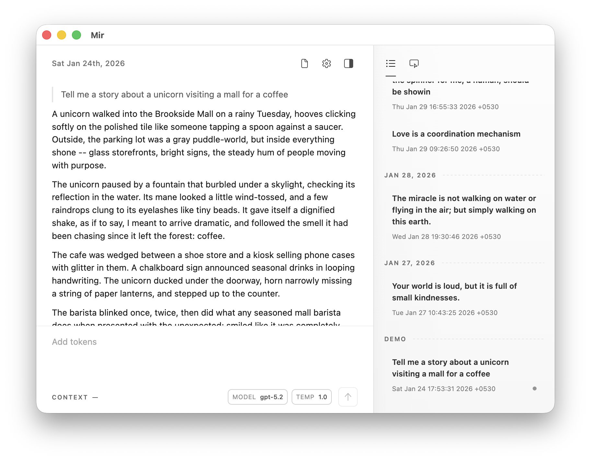

# Mir

This is Mir, a new way to interface with LLMs.



## Docs 📚

- [docs/user-guide.md](docs/user-guide.md): User-facing documentation.
- [docs/architecture.md](docs/architecture.md): High level architecture overview for developers.

## Repository layout 🧭

- _apps/desktop_: Electron + React desktop app.
- ~~_apps/mobile_: Expo + React Native mobile app.~~ **WIP**
- _packages/core_: Shared TypeScript package.

## Requirements 🧩

### All platforms

- Node.js
- pnpm (`corepack enable` or install pnpm globally).

### Desktop

- No other dependencies.

### iOS

- Xcode (for iOS Simulator and native builds).
- CocoaPods (`brew install cocoapods` or `sudo gem install cocoapods`).

### Android

- Android Studio + Android SDK (for Android emulator and native builds).
- `ANDROID_HOME` set, with `platform-tools` on your PATH.

## Setup 🛠️

```sh
pnpm install
```

## Running 🚀

### Desktop (Electron)

```sh
pnpm dev:desktop
```

```sh
pnpm build:desktop
```

On macOS, release artifacts are written to `apps/desktop/dist` (for example `.dmg` files).

### Mobile (Expo)

Start Metro, then press `i` in the Metro terminal to run the app in the iOS Simulator, or `a` to run it on the Android emulator.

```sh
pnpm dev:mobile
```

Alternatively, you can start Metro + iOS Simulator in one command:

```sh
pnpm ios
```

Or launch Metro + Android emulator similarly with:

```sh
pnpm android
```

These run the app inside Expo Go on the simulator/emulator.

To run on a physical device (or when you need to recompile any of the custom native modules), use:

```sh
pnpm ios:device
```

```sh
pnpm android:device
```

These will create native builds. Hot reload will still work.

### Shared core package

`mir-core` is consumed from source in both apps, so changes should hot reload.

> If the mobile bundler misses updates, restart Metro.

## Lint ✅

```sh
pnpm lint
```

Runs TypeScript typechecking and ESLint across the workspace.

## Releasing macOS builds on GitHub 🚢

Pushing a version tag like `v0.1.0` triggers `.github/workflows/release-desktop-macos.yml`, which:

- Builds the desktop app on a `macos-latest` runner.
- Produces Apple Silicon (`arm64`) macOS binaries with `electron-builder`.
- Publishes generated artifacts to a GitHub Release for that tag.

Tag and push a release:

```sh
git tag v0.1.0
git push origin v0.1.0
```
